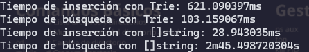

# Clase: Estructuras para Optimización de Memoria | Clase 11

## Proyecto: Diccionario con Go con Trie
> Seleccione este proyecto por que creo que lo voy a utilizar constantemente en mi trabajo. Existe otros algoritmo que me interesaria, pero hago este en especial por su beneficio.

Cosas que se utilizan que me parece interesante:

Se trabaja sobre prefijo

Pude ver la forma y entender como funciona un arbol, ya que ah este momento todavia no lo vi en la universidad(primer año)

Utilizamos punteros

Recursos:
+ https://aprende.olimpiada-informatica.org/algoritmia-tries
+ https://drstearns.github.io/tutorials/trie/
+ [Mejoras que se puede hacer al Trie](https://www.linkedin.com/advice/3/how-can-you-optimize-performance-trie-skills-algorithms-ctmnf?lang=es&originalSubdomain=es)

## Pseudocodigo:

```
Definir estructura Node
    Contiene un mapa llamado Children
        Clave: cadena de texto
        Valor: puntero a estructura Node
Fin de estructura Node

Función NewNode → devuelve puntero a Node
    Inicializar node como nuevo Node
        Children: diccionario vacío (string → *Node)
    Retornar node
Fin

Definir estructura Trie
    Contiene un puntero a estructura Node
Fin de estructura Trie

Función NewTrie
    Crear nodo raíz con NewNode()
    Asignar nodo raíz a RootNode del Trie
    Devolver puntero al nuevo Trie
Fin

Función strippedWord(palabra)
    Convertir la palabra a minúsculas
    Eliminar todos los espacios de la palabra
    Devolver la palabra modificada
Fin de función

Función Insertar recibe una Palabra y devuelve un error
    nodoActual ← nodo raíz del trie

    Para cada letra en la palabra (convertida a minúsculas y sin espacios) hacer
        letraStr ← convertir letra a string

        Si letraStr no está en los hijos de nodoActual entonces
            Crear un nuevo nodo
            Asignar el nuevo nodo como hijo de nodoActual en la clave letraStr
        Fin Si

        nodoActual ← hijo correspondiente a letraStr
    Fin Para

    Devolver nil (sin error)
Fin Función

Función BuscarPalabra recibe una Palabra y devuelve un valor booleano
    nodoActual ← nodo raíz del trie

    Para cada letra en la palabra (convertida a minúsculas y sin espacios) hacer
        letraStr ← convertir letra a string

        Si letraStr está en los hijos de nodoActual entonces
            nodoActual ← hijo correspondiente a letraStr
        Sino
            Devolver falso (la palabra no está en el trie)
        Fin Si
    Fin Para

    Devolver verdadero (la palabra existe en el trie)
Fin Función
```

Este fragmento se encarga de inicializar un nuevo nodo del árbol, con su estructura interna (Children) lista para almacenar hijos.
```
Función NewNode → devuelve puntero a Node
    Inicializar node como nuevo Node
        Children: diccionario vacío (string → *Node)
    Retornar node
Fin
```

RootNode *Node: un puntero al nodo raíz del trie. Desde este nodo se construyen todas las ramas del árbol que representan las palabras insertadas
```
Definir estructura Trie
    Contiene un puntero a estructura Node
Fin de estructura Trie
```

Descripcion de lo que hace la funcion NewTrie
1. Crea la estructura base del Trie que luego será usada para insertar y buscar palabras.
2. Asegura que cada Trie comience limpio, con un nodo raíz vacío y sin hijos.
3. Establece la base sobre la cual se construyen las ramas del árbol (una por cada carácter insertado).
```
Función NewTrie
    Crear nodo raíz con NewNode()
    Asignar nodo raíz a RootNode del Trie
    Devolver puntero al nuevo Trie
Fin
```

## Autopreguntas
¿Por que llama a la misma estructura Node?
La razón por la que se llama Children y apunta a *Node (es decir, a la misma estructura Node) es porque se está construyendo una estructura recursiva.

Mis Palabras: Es decir que se esta actualizando esa posicion de memoria constantemente y no se esta creando otra

## Glosario:

Puntero: Direccion especifica en la memoria

# PRUEBAS


Para realizar esta prueba use este .txt que tiene alrededor de 1millon de palabras.
https://raw.githubusercontent.com/dwyl/english-words/master/words.txt

Le pase el resultado a chatGPT para que me analize el resultado y me comento esto:

Análisis de los resultados:
Tiempo de inserción con Trie: 621.09ms

La inserción en un Trie suele ser más lenta en comparación con una lista plana ([]string), especialmente cuando trabajamos con un número grande de palabras. Esto se debe a que cada letra de una palabra se inserta de manera individual, creando nodos en cada paso.

Tiempo de búsqueda con Trie: 103.16ms

La búsqueda en el Trie es más eficiente que la búsqueda en un []string, ya que con un Trie, puedes aprovechar la estructura de árbol que permite descartar muchas palabras rápidamente.

Tiempo de inserción con []string: 28.94ms

Insertar en un []string es mucho más rápido, ya que simplemente se agrega una palabra al final del array. Sin embargo, a medida que la lista crece, la búsqueda en este tipo de estructura puede volverse más lenta.

Tiempo de búsqueda con []string: 2m 45.50s

Como esperábamos, la búsqueda en un []string es mucho más lenta. Debe recorrer toda la lista secuencialmente hasta encontrar la palabra, lo que tiene un costo de tiempo lineal O(n), especialmente cuando el número de palabras es grande.

Conclusiones:
Inserción en Trie vs. []string: Aunque el Trie tiene un tiempo de inserción más alto, este algoritmo está diseñado para optimizar la búsqueda. La inserción en un []string es rápida, pero la búsqueda se vuelve ineficiente a medida que el número de elementos crece.

Búsqueda en Trie vs. []string: El Trie es mucho más eficiente para búsquedas, especialmente cuando trabajas con una gran cantidad de palabras. Esto es gracias a la estructura de árbol del Trie, que permite un acceso rápido, en lugar de hacer una búsqueda lineal en la lista.
